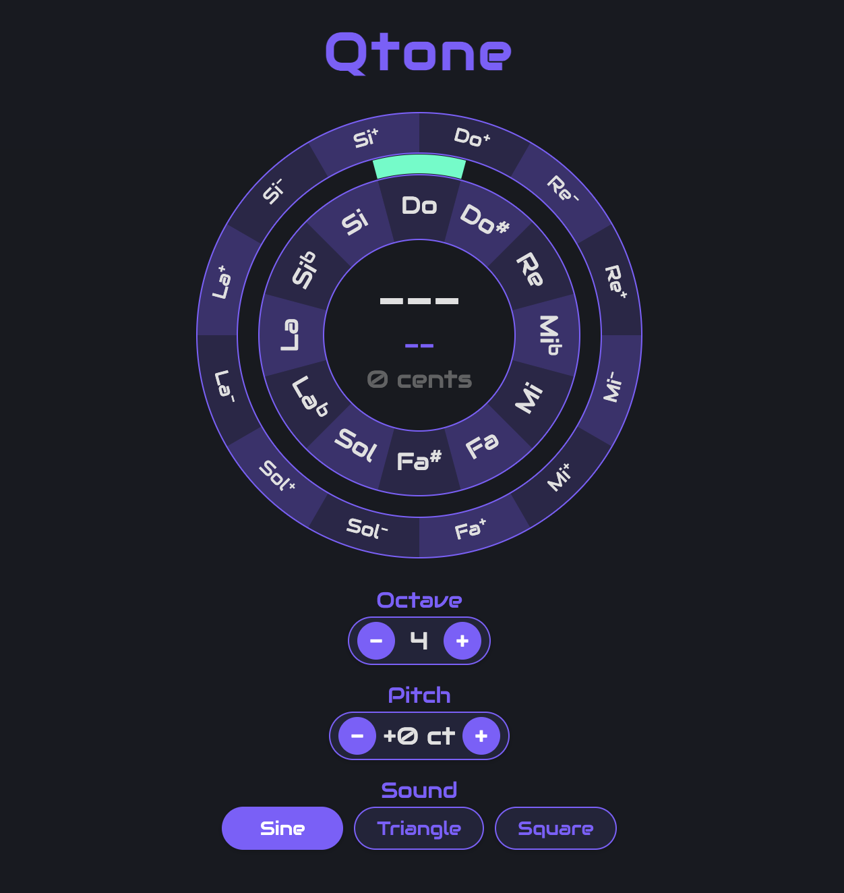

# Qtone Web



A quarter-tone tuner for the web — companion to the Qtone iOS app.

Designed for musicians who work with Persian dastgah, Arabic maqam, Turkish makam, and other microtonal music systems.

**Live:** [https://doctorhy.github.io/Qtone-web](https://doctorhy.github.io/Qtone-web)

## What It Does

Qtone Web has two main functions:

1. **Tuner** — Listens through your microphone, detects the pitch in real time, and shows the closest note with cents deviation on a circular display. Supports both 12-tone (semitones) and 24-tone (quarter-tones).
2. **Reference Tone Generator** — Tap any note on the circle to hear it played back at the correct pitch. Choose from Sine, Triangle, or Square waveforms and adjust the octave.

## Features

- **Pitch Detection** — Real-time pitch detection via microphone with smoothed display
- **Quarter-Tone Support** — Full 24-note system with half-sharp (+) and half-flat (-) notation (e.g., Do+, Re-, Mi+)
- **Italian Solfege Naming** — Do, Re, Mi, Fa, Sol, La, Si (with accidentals: Do#, Mib, Fa#, Lab, Sib)
- **Circular Tuner Display**
  - Inner ring: 12 semitones — tap to play reference tone
  - Outer ring: 12 quarter-tones — tap to play quarter-tone reference
  - Green indicator arc: shows detected pitch position in real time
  - Center: displays detected note name, quarter-tone name, and cents deviation
- **Reference Sounds** — Three waveform options (Sine, Triangle, Square), all mathematically generated for perfect tuning across all octaves
- **Octave Selection** — Choose octave 0–8 for reference tone playback
- **Independent Sori/Koron Offsets** — Set sori (+) and koron (-) independently to 42, 50, or 58 cents
- **Responsive** — Works on desktop and mobile browsers

## Quarter-Tone Notation

Quarter-tones are microtonal intervals that fall between standard semitones. Qtone uses **+** and **-** symbols to represent them:

- **+ ([sori](https://en.wikipedia.org/wiki/Sori_(music)) / half-sharp)** — The note is raised by approximately 42 cents above the natural note. For example, **Do+** is between Do and Do#.
- **- ([koron](https://en.wikipedia.org/wiki/Koron_(music)) / half-flat)** — The note is lowered by approximately 42 cents below the natural note. For example, **Re-** is between Do# and Re.

In Persian music, these quarter-tone accidentals are called **sori** (+) and **koron** (-). The default interval is **42 cents**, but each can be independently set to **42**, **50**, or **58** cents to match different maqam/dastgah tuning systems.

## Center Display

When the tuner detects a pitch, the center of the circle shows three pieces of information:

1. **Note Name + Octave** (top, large text) — The closest semitone to the detected pitch, e.g., **La4** means La in octave 4 (A4 = 440 Hz).
2. **Quarter-Tone Name** (middle, purple text) — The closest quarter-tone name, e.g., **La** if in tune, or **La+** if the pitch is about 42 cents sharp.
3. **Cents Deviation** (bottom) — How many cents sharp or flat the detected pitch is from the nearest semitone. **0 cents** means perfectly in tune. The text turns **green** when within ±5 cents.

When no sound is detected, the display shows **"--"**.

## How the Circle Works

The tuner uses two concentric rings:

```
    ┌─────────────────┐
    │   Outer Ring     │  ← 12 quarter-tone segments (tap to play)
    │  ┌───────────┐  │
    │  │ Inner Ring │  │  ← 12 semitone segments (tap to play)
    │  │  ┌─────┐  │  │
    │  │  │Note │  │  │  ← Center: detected note + cents
    │  │  │Info │  │  │
    │  │  └─────┘  │  │
    │  └───────────┘  │
    └─────────────────┘
```

- The **green arc** in the gap between rings moves to indicate the detected pitch
- When the green arc aligns with a note label and cents reads close to 0, you're in tune
- Cents deviation turns green when within ±5 cents of the target note

## Controls

Below the tuner circle, there are three control sections:

### Octave (+/-)
Sets the octave for reference tone playback, from **0** (lowest) to **8** (highest). The default is **4** (middle octave, where La = 440 Hz). Tap **-** to go lower, **+** to go higher.

### Sound (Sine / Triangle / Square)
Selects the waveform used for reference tone playback:
- **Sine** — Pure, clean tone. Best for precise tuning.
- **Triangle** — Warmer, softer tone with a flute-like quality (default). Louder on phone speakers.
- **Square** — Hollow, clarinet-like tone with a stronger harmonic character.

### Quarter-tone (Koron - / Sori +)
Sets the quarter-tone offset for each accidental independently. Choose **42**, **50**, or **58** cents for each:
- **Koron (-)** — How many cents flat from the next semitone above. Default: **42**.
- **Sori (+)** — How many cents sharp from the semitone below. Default: **42**.

Different maqams and dastgahs use different quarter-tone intervals. For example, a sori of 58 cents places the quarter-tone closer to the semitone above (equivalent to a koron of 42 cents from that semitone).

## Tech Stack

- **Vanilla HTML/CSS/JS** — No frameworks, no build step
- **Web Audio API** — Oscillators for reference tones, microphone input for pitch detection
- **Canvas** — Circular tuner display
- **YIN Algorithm** — Autocorrelation-based pitch detection with harmonic disambiguation

## Browser Requirements

- A modern browser with Web Audio API support (Chrome, Firefox, Safari, Edge)
- Microphone access (for pitch detection)
- Works on both desktop and mobile

## Running Locally

Open `index.html` directly in your browser — no build step or server required.

## License

All rights reserved.
